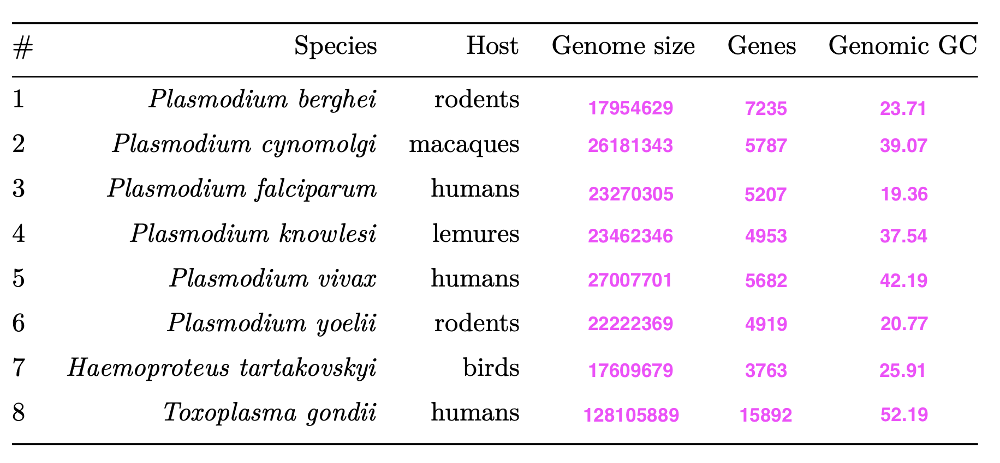

## Answers to questions

1. **Do you think that in a phylogenetic tree the parasites that use  similar hosts will group together?**

Not always. In a phylogenetic tree, parasites usually group by how genetically related they are not only by what host they infect. So parasites with similar hosts can group together but they can also be in different branches if host switching happened.

2. **With the new genome file, make a gene prediction. You will probably still have some scaffolds that derive from the bird. These should be short. Why?***

They can still remain because GC filtering is not perfect. Some host scaffolds have GC content similar to the parasite
so they pass the filter. The remaining contaminanted scaffolds are usually short fragments from mixed assembly.

3. **Insert the missing data in the above table. Use bash, not inter-
net!**

Commands used: 

for the genome size 
```bash
grep -v "^>" data/Plasmodium_berghei.genome | tr -d "\n"| wc -m [this was used for all the species]
```

for the number of genes 
``` bash
cut -f3  data/vivax.gtf | grep -c "gene" #this was used for all the species expect from the Toxoplasma for which we used this command: 
cut -f9 data/Tg.gff |sort | uniq | wc -l]
```

for the GC content
``` bash 
GC=$(grep -v "^>"  data/Plasmodium_cynomolgi.genome| grep -o "[GC]" | wc -l)
TOTAL=$(grep -v "^>" data/Plasmodium_cynomolgi.genome| tr -d "\n"| wc -m)
echo "scale=4; $GC * 100 / $TOTAL" | bc
#this was used for all the species
```
The final table is as follows:

                    
4. **Compare the genome sizes with other eukaryotes and bacteria. Discuss with your partner (that is student partner) the reason for the observed genome sizes.**

The genome sizes of the parasites are generally smaller than those of other eukaryotes and bacteria. This is because parasites often reduce their genome size. They lose genes that are not essential for their survival in the host environment. They rely on the host for many functions, so they can afford to lose certain genes that free living organisms have. 

5. **What may cause the biased GC-contents in some of the species?**

The biased GC content in some species can be caused by many factors. One reason can be repetitive elements in the genome, which can have different GC content than the rest of the genome. Another reason could be the evolutionary history of the species, where some species may have undergone selection for higher or lower GC content. Additionally, the host environment can also play a role in making the GC content of the parasite's genome.

6. **What does the curly braces notation stand for?**

``` bash
nohup proteinortho6.pl {Ht,Pb,Pc,Pf,Pk,Pv,Py,Tg}.faa &
```
It is a bash expansion. It allows us to run the command for multiple files at once. In this case, it will run the proteinortho6.pl command for each of the .faa files corresponding to the species listed in the curly braces. 

7. **Compare how many BUSCOs (orthologues proteins) that are found in each proteome. Do the investigated parasites have close to complete numbers of BUSCOs?**

Number of Complete + Duplicated BUSCOs in each proteome is:

- Ht: 322 (66.9%)
- Pb: 367 (76.3%)
- Pc: 468 (97.3%)
- Pf: 476 (99.0%)
- Pk: 349 (72.6%)
- Pv: 480 (99.8%)
- Py: 473 (98.3%)
- Tg: 382 (79.4%) (mostly duplicated)

So, not all the parasites are close to complete. Pc, Pf, Pv, and Py are close to complete with over 97% of BUSCOs found, while Pb and Pk are moderate. Ht and Tg have lower completeness, with Ht having the lowest at 66.9%. 

8. **Do you think that the assembly of the Haemoproteus tartakowskyi genome is areasonable approximation of the true genome?**

The assembly of the *Haemoproteus tartakowskyi* genome is not a reasonable approximation of the true genome, as it has a low completeness of 66.9% based on the BUSCO analysis. That means that a certain number of genes are missing from the assembly, which can lead to an incomplete evolutionary analysis and may not represent the true genetic diversity of the species. Also, the host contamination in the assembly cam lead to false positives or false negatives in the analysis. 

9. **How many of the BUSCOs are found in all eight organisms?**

We can run the command:
``` bash
ls results/proteins/busco/orthologs_8species/*.faa | wc -l
```
So, there are 158 shared BUSCOs in all 8 organisms.

10. **If *Toxoplasma* isremoved, how many BUSCOs are shared among the remaining seven species. Interpret!**

We can run the command:
``` bash
ls results/proteins/busco/orthologs_7species_no_tg/*.faa | wc -l
```
So there are 189 shared BUSCOs among the 7 species without *Toxoplasma*. 

This is higher than with all 8 species, which means that *Toxoplasma* is the most divergent species and many BUSCOs are not cleanly shared with it (lots of duplicates and fragments). So removing it increases the number of shared BUSCOs among the malaria parasites.

11. **Does all protein trees reflect the “true" species tree?**

No, not all protein trees reflect the true species tree. Each protein tree is based on one gene, and single genes can have different evolutionary histories due to duplication events, natural selection, gene loss or gene transfer. That is why we compare many BUSCO trees and use a consensus tree, which is a better estimation of the species tree.

12. **What is the phylogenetic position of Plasmodium falciparum?**

*Plasmodium falciparum* is a species of malaria parasite that infects humans. In the phylogenetic tree, it is within the Plasmodium clade and sister to *Haemoproteus tartakowskyi*. 

13. **Do you think that the GC contents have an impact on the tree topology?**

Yes it does. The GC content can affect the tree topology because some sequences with similar GC content can cluster together, even if they are not closely related. Also if contaminanted sequences from the host remain, they may be wrongly included and swift branches to incorrect positions.

14. **Do you think that the host range has an impact on the tree topology?**

Yes, but partly. Host range can influence tree topology because parasites adapting to similar hosts can face similar selection pressures, which may make some genes look more similar. However, the main signal should still be shared ancestry, so host range alone does not determine the whole tree especially with host switching events being a likely scenario in parasite evolution.

15. **Are the BUSCO proteins also found as orthologs in the proteinortho output?**

